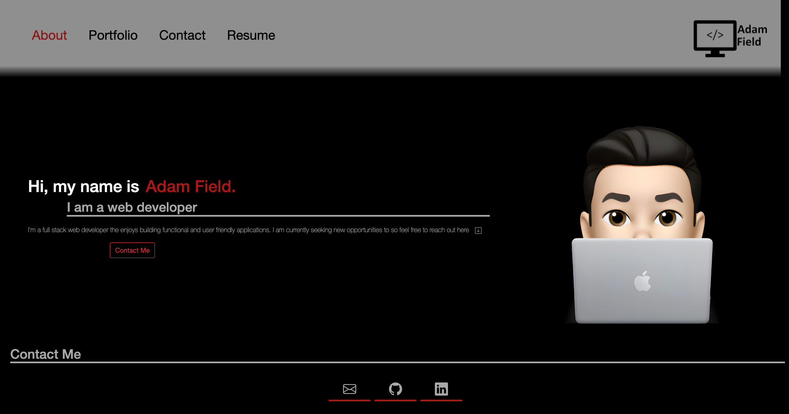
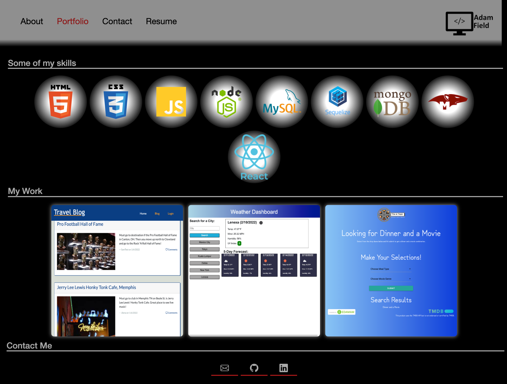
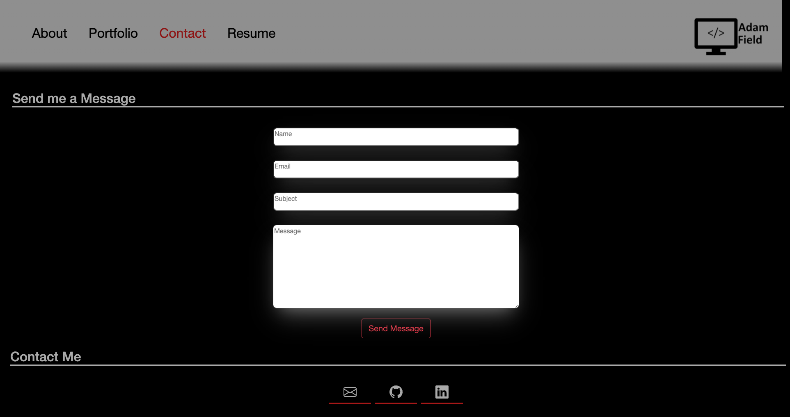
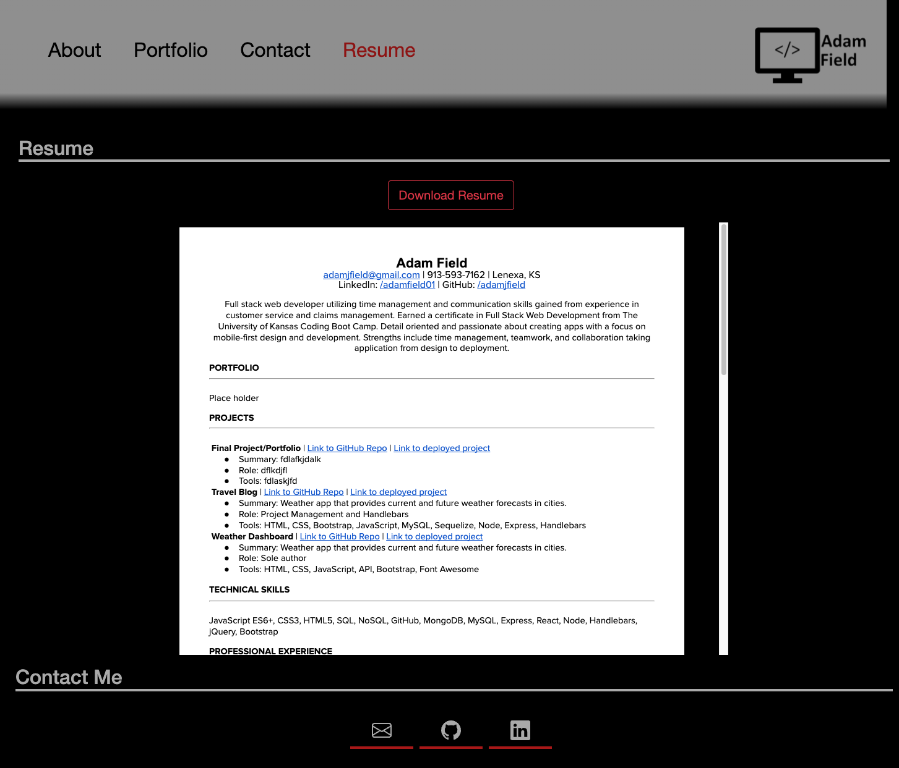

  # React Portfolio

  
  
    

  ## Description

  This is my personal profesional portfolio created using React.

  ## Table of Contents

  * [Installation](#installation)
  * [License](#license)
  * [Contributing](#contributing)
  * [Demo](#demo)
  * [Tests](#tests)
  * [Questions](#questions)
  
  
  ## Installation

  To install necessary dependencies, run the following command:
    
    (npm i)

  
  ## License

  The application is covered under the following license:

  
  Info on License: [MIT](https://choosealicense.com/licenses/mit)
    
  
  ## Contributing

  If you wish to contribute to or use this design please contact me at my email below.
  

  
  ## Demo

### Home Page

### Portfolio Page

### Contact Page

### Resume Page

  
  ## Test

    
  There are currently no test set up for this application

  
  ## Questions

  If you have any questions about the repo, open an issue or contact me directly at [adamjfield@gmail.com](mailto:adamjfield@gmail.com). You can find more of my work at [adamjfield](https://github.com/adamjfield).
